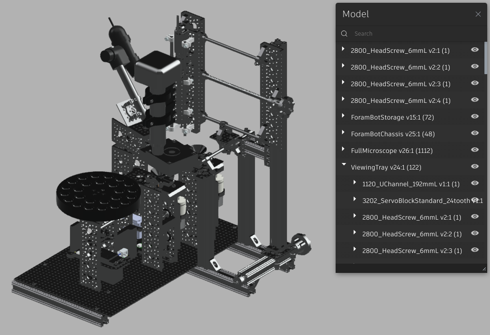

# Forabot

It is recommended to view the following in an environment that can present markdown files properly (Typora, Visual Studio Code, Markdown Preview extension for browser, etc.)

In an effort to minimize issues with software version issues, we use [Anaconda](https://www.anaconda.com/) environments for python code were possible.

For any external software used, aim to download named version numbers to limit issues.

Find 3D printed parts, required software installations, and full parts list with order links [here](https://drive.google.com/drive/folders/1eS0E0sS-JCQqd6CAm0YDWcOFf7g4oOFU?usp=sharing)

## Electronics Wiring

Follow the [Installation Guide](electronics_wiring/InstallationGuide.html) under the electronics_wiring folder.

## Physical System Setup

See the documentation for building the system as a text description [here](ForaBot_build_doc_metric_CAD.md).

A CAD design of the system can be used for reference or clarification when any instructions are unclear. The CAD was designed for accuracy, so while it could be used as a standalone document for the build, written instructions may provide a helpful indication of build order.

- [Forabot Model](https://a360.co/3drdB2K)

- Password: Forams2022

  

When looking at the Forabot Model, use model browser in the bottom right side of the dock to a tree view of what components are used to build each part of the system. Alternatively, the most up to date purchase order form can be found [here](https://docs.google.com/spreadsheets/d/1En-3Jp51wM7dr5tQlyqNDFpN-2m2ZlPKbixPaAnKt6w/edit?usp=sharing)

Parts which need to be 3D printed can be found [here](https://drive.google.com/drive/folders/1KUDNA-MjvVvopqXl2LDJcQh85TBeGugj?usp=sharing). As a note, all parts were printed on a [Craftbot](https://craftbot.com/products/craftbot-plus-pro) using PLA except for the funnels. Funnels were printed using a [Formlabs Form3](https://formlabs.com/) with SLA. The funnel print was washed with IPA and pcb drill bits were used to ensure the hole at the base of the funnel was clear and an appropriate size. After cleaning the part, it was cured using UV light as recommended by Formlabs.

### 	Forabot Software and Physical Calibration

For physical calibration (aligning microscope, needles, foram storage, etc) along with setting up a personal computer software and Raspberry Pi for operation, see [forams-bot/README.md](forams-bot/README.md).
