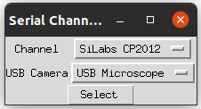

# Forabot

This is a single code base which needs to be installed to and run from two different locations

	- Raspberry Pi 
	- Personal Computer (Linux or Windows)

## Setting up the Raspberry Pi

Refer to the [Raspberry pi setup](setup/rpi_setup.md) document

## Setting up the Host PC

Refer to the [client setup](setup/client_setup.md) document.

Refer to the [error detection setup](setup/error_detection_setup.md) document for modifying the error detection values.

## Calibrating the Forabot

Once the Raspberry Pi is setup and each motor is running successfully, the motor positions can be calibrated using [hardware setup](setup/hardware_setup.md) document.

## Running the Forabot

If the [service](setup/foramsbot.service) file was not added as a systemd service as part of the last optional setup setup in [Raspberry pi setup](setup/rpi_setup.md), then the Raspberry pi code needs to be run. The code can be run from the [src](src) folder.

```
conda activate foram-bot
sudo python3 run_server.py
```

Next the PC code needs to be run. First, ensure the Microscope camera (Amscope camera) and error detection cameras are connected to the computer along with the Serial Cable. The code can be run from the [src](src) folder.

```
conda activate foram-bot
python run_client.py
```

The first window requires a selection of the Serial communication cable and USB Camera which is connected to the error detection camera. It is likely that only a single option will be available for the Channel selection unless there are other COM ports in use on your computer. For the USB Camera, integrated cameras (often found on laptops) will appear as well as many other USB camera models. The AmScope camera (MU1803-HS) should not appear here if the drivers were properly installed.



The main window will look similar to the following image:


- The selections for each option can be modified to achieve the desired result
  - To limit the number of forams run, choose the top selection and enter the number of forams you would like imaged.
  - The "Run All" selection runs until it has reached the Failure Threshold value (this may occur before all forams have been imaged, but a stoppage will occur when the imaging well is empty as it will continually fail to pick a foram.)
  - The Failure Threshold indicates how many failures should occur before the system stops running.
  - Number Orientations indicates how many times a foram that is in the Imaging Funnel should be picked. Each orientation will create a new folder under the foram folder for 30 new focal plane and lighting direction images to be saved.
