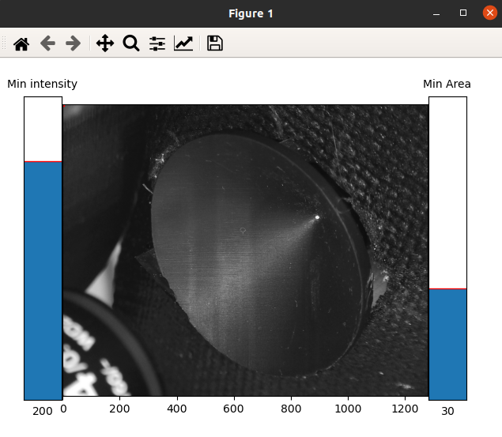

# Error Detection Setup

#### Foram in Funnel Detection

To modify the error detection parameters to better fit your environment, run 

`python funnel_detection_setup.py example_foram_detection.png ` 

Drag an area to define a bounding box to maximize the area within the funnel, but does not contain any part of the image that is not within the funnel. This bounding box will define where forams are detected.

Move the left slider up if false positives are occurring (areas with no foram are detected with a green circle).

Move the left slider down if the foram is not detected with a green circle

Move the right slider up if small bright white objects are being detected.

Move the right slider down if the foram is bright, but isn't detected because it is too small.

Find good values for these to use under many conditions. The values should be printed into the terminal once they are changed.

Modify the BlobIdentifier class in [ForamDetector.py](../src/user/ForamDetector.py)

The left slider value is 'params.minThreshold'

The right slider value is 'params.minArea'

The bounding box should be used to modify the 'img = image[350:550,700:950]' with the 'Image Patch Location' values. Note for 'Image Patch Location' x0,y0,x1,y1' they should be entered as 'img = image[y0:y1,x0:x1]'

#### Foram Pick Detection

Similarly, the same function can be run to find bounding box values for the foram pick identification. The sliders can be ignored for this.

Modify the ConvIdentifier class in [ForamDetector.py](../src/user/ForamDetector.py) such that the classify image resizing 'image = image_lg[340:440,600:700]' is edited similarly to above.